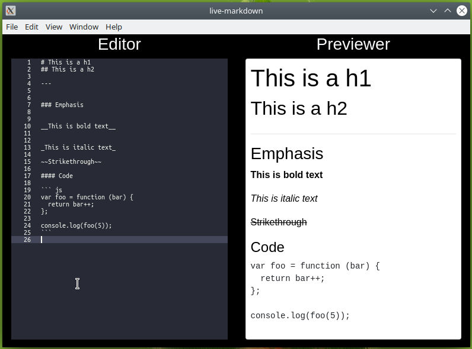

# live-markdown



## Project setup

```bash
npm install
```

### Compiles and hot-reloads for development

```bash
npm run serve
```

### Compile and run in Desktop Application mode

```bash
npm run electron:serve
```

### Compiles and minifies for production

```bash
npm run build
```
